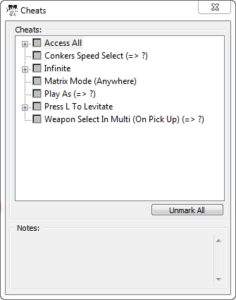

## ➕ <a name="adding-cheats">Adding Cheats</a>

MiB64 allows you to add cheats either through the GUI or manually via the `.cdb` file.

---

### 🧪 Adding via GUI

1. Open MiB64 and load your ROM.
2. Go to the Cheats menu.
3. Click **Add Cheat**.
4. Enter a name and code.

<a href="./assets/images/01/Add11.png" target="_blank">
  
</a>
<p class="has-text-align-center"><strong>Click image to enlarge</strong></p>
<!-- ClauseEcho: Add11 Interactive Image -->

Repeat for each cheat you want to add.

---

### 🧾 Manual Entry via `.cdb` File

If you prefer direct editing:

1. Close MiB64.
2. Open `MiB64.cdb` in a text editor (e.g. Notepad).
3. Search for your game name:
   ```text
   Name=Super Mario 64
   ```
4. Add your cheat below the existing block:
   ```text
   [New-CRC-C:45]
   Name=SUPER MARIO 64 (Region)
   Cheat0="Test Cheat",80123456 0001
   ```

5. Save and overwrite the file.
6. Restart MiB64 and verify the cheat appears.

---

### 🧠 Notes

- Do **not** include Enable or Keycode cheats—they’re only for physical devices.
- MiB64 handles activation internally.
- Use correct region codes:
  - `(U)` = USA
  - `(E)` = Europe
  - `(J)` = Japan
  - `(A)` = Australia
  - `(G)` = Germany
  - `(F)` = France

---

### 🧷 Example Cheat Format

```text
Cheat0="Infinite Lives",80123456 0009
Cheat1="Unlock All Levels",80123478 00FF
```

Each cheat must be numbered sequentially and formatted with a space between address and value.

---

<!-- ClauseLock: Adding Cheats Section Echoed -->
