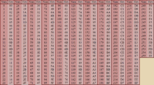
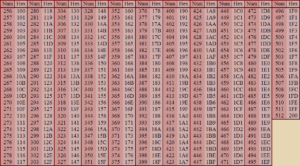

## ❓ <a name="cheats-faq">MiB64 Cheats FAQ</a>  
**Written by Gent**

This should help you with any questions about adding & editing codes in the Cheat Database. Maximize this window if you're having trouble viewing it.

---

✅ Why don’t the cheats work in MiB64?

I ticked what I wanted to use but it does nothing on all games I’ve tried.

Make sure you’ve enabled your Memory Pak.  
Go to: Options → Configure Controller Plugin

---

❌ Why is the Cheats Menu blank?

The game has no cheat support yet.  
Make sure MiB64.cdb is in the root folder.  
If you’ve opened too many ROMs in one session, restart MiB64.  
You may need to manually add a cheat.

Example:

```text
Name: Test
Code: 80123456 0001
```

Then open MiB64.cdb in a text editor.  
Search for your game name (e.g. Name=Super Mario 64)  
Copy the full cheat block and paste it below your test entry.

```text
[New-CRC-C:45]
Name=SUPER MARIO 64 (Region)
Cheat0="Test Cheat",80123456 0001
```

Delete the old entry, save the file, and restart MiB64.

---

🔁 Remembering Cheats Between Sessions

Go to: Options → Settings → Options → Remember Selected Cheats  
Cheats left on will auto-enable next time you load the game.  
Turn off any you don’t want before closing MiB64.

---

🌐 Where to Find Cheat Codes

Google “N64 Action Replay cheats” for PAL  
Google “N64 Gameshark cheats” for NTSC

---

➕ How to Add Cheat Codes

Click [Adding Cheats](./adding-cheats.md) for full instructions.  
MiB64 does not require Enable or Keycode cheats—they’re for physical devices only.

---

🔍 Can I Search for My Own Cheats?

Yes! MiB64 allows you to search and test results via the GUI.  
See [Preparing to Search](./cheat-search.md#preparing-to-search) for more info.

---

✏️ Can I Add/Edit/Delete Cheats Without a Text Editor?

Yes! MiB64 supports full GUI control.  
See: [Adding](./adding-cheats.md), [Editing](./editing-cheats.md), [Deleting](./deleting-cheats.md), [Using Cheats](./using-cheats.md)

---

📝 Can I Still Edit the .cdb File Manually?

Yes, though it’s optional.  
Open MiB64.cdb in WordPad and search for the game name and region.

Example:

```text
Cheat0="Ostrich Mario",8033B3BC 0090
Cheat1="Mario Runs Backwards",8033B3BE 0070
```

Codes must be spaced like `XXXXXXXX XXXX`, not `XXXXXXXXXXXX`.

---

---

🔗 Option Chains and Notes

Example:

```text
Cheat5="Open Level Character Modifier",8125508A 00??
Cheat5_O=$01 Easy Level,$02 Easy & Normal Level,$03
Cheat5_N=Choose your level. Don’t use with other modifiers.
```

- `_O=` defines selectable options.
- `_N=` adds a note in the GUI.
- `??` must match the number of `$XX` values.

---

📦 Grouped Cheats with `\`

Use `\` to group cheats under expandable categories (e.g. Player 1, Multiplayer).  
Grouped cheats appear with a `+` icon in the menu.

---

🌍 Region Codes

```text
(JU) = :41 (NTSC)
(J)  = :4A (NTSC Japan)
(U)  = :45 (NTSC USA)
(E)  = :50 (PAL Europe)
(A)  = :55 (PAL Australia)
(G)  = :44 (PAL Germany)
(F)  = :46 (PAL France)
(I)  = :49 (PAL Italy)
(S)  = :53 (PAL Spain)
```

---

📈 Cheat Limits

- Max 500 cheats per game (`Cheat0` to `Cheat499`)
- Max 100 codes per cheat line
- GUI will crash if you exceed 500
- Only first 500 will show if editing manually

---

🧬 Stacked Activators

Yes, MiB64 supports stacked activators—use them for hacked moves in No Mercy.

---

🔢 Button & Activator Codes

MiB64 supports:

- `88`, `89` → GS/AR Button Codes (use F9 for quick injection)
- `D0`, `D1`, `D2` → Activator Codes (e.g. Press L to Levitate)

---

🚫 Unsupported Codes

```text
CC/DD/EE-000000 0000 → Disable Expansion Pak
DE-XXXXXX 0000 → Download & Execute
FF-XXXXXX 0000 → Store Activated Cheat Codes
```

---

🧯 Equalizer Compatibility

Can I use codes marked “Not compatible with Equalizer”?  
Yes. Equalizer is a simplified Action Replay clone. MiB64 supports these codes.

---

🔁 Serial Repeaters (Patch Codes)

Yes, MiB64 supports patch codes.

Example:

```text
California Speed
Cheat2="Have All\Cars",50001504 0000,800AAE5B 0001
```

Let’s look at the code we are going to see change from:

```text
800AAE5B 0001
```

To:

```text
800AAEAB 0001
```

---

---

Let’s look at the code we are going to see change from:

```text
800AAE5B 0001
```

To:

```text
800AAEAB 0001
```

That’s a jump of `50` hex.

So we are going to repeat the code `21` times with a jump of `4` hex.

This is what the patch code does:

```text
50001504 0000
```

The first 4 digits `5000` tell the emulator it’s a patch code.  
The next 4 digits `1504` tell it how many times to repeat the code and how far to jump each time.

So `15` hex = `21` decimal  
And `04` hex = `4` decimal

The next line is the code we want to repeat:

```text
800AAE5B 0001
```

So the emulator will repeat this code `21` times, jumping `4` hex each time.

---

🧮 Hexadecimal Reference

#### Numbers 0–255 (Dec) → 00–FF (Hex)

<a href="./assets/images/01/hex_1_0-255.png" target="_blank">
  
</a>
<p class="has-text-align-center"><strong>Click image to enlarge</strong></p>

#### Numbers 256–512 (Dec) → 100–200 (Hex)

<a href="./assets/images/01/hex_2_256-512.png" target="_blank">
  
</a>
<p class="has-text-align-center"><strong>Click image to enlarge</strong></p>

---

<!-- ClauseLock: Cheats FAQ Finalized -->
