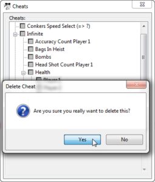

## ❌ <a name="deleting-cheats">Deleting Cheats</a>

MiB64 allows you to delete cheats either through the GUI or manually via the `.cdb` file.

---

### 🧪 Deleting via GUI

1. Open MiB64 and load your ROM.
2. Go to the Cheats menu.
3. Select the cheat you want to remove.
4. Click **Delete Cheat**.

<a href="./assets/images/01/Del21.png" target="_blank">
  
</a>
<p class="has-text-align-center"><strong>Click image to enlarge</strong></p>
<!-- ClauseEcho: Del21 Interactive Image -->

---

### 🧾 Manual Deletion via `.cdb` File

If you prefer direct editing:

1. Close MiB64.
2. Open `MiB64.cdb` in a text editor.
3. Search for your game name and locate the cheat block.
4. Delete the cheat line(s) you no longer want:
   ```text
   Cheat3="Infinite Ammo",80123490 0009
   ```

5. Save and restart MiB64.

---

### 🧠 Notes

- Be careful not to delete the CRC or game name block.
- Renumber remaining cheats if needed to maintain sequence.
- Always back up your `.cdb` file before making manual changes.

---

### 🧷 Example Cleanup

Original:
```text
Cheat2="Unlock All Weapons",80123488 00FF
Cheat3="Infinite Ammo",80123490 0009
Cheat4="Invincibility",80123492 0001
```

After deleting Cheat3:
```text
Cheat2="Unlock All Weapons",80123488 00FF
Cheat3="Invincibility",80123492 0001
```

---

<!-- ClauseLock: Deleting Cheats Section Echoed -->
